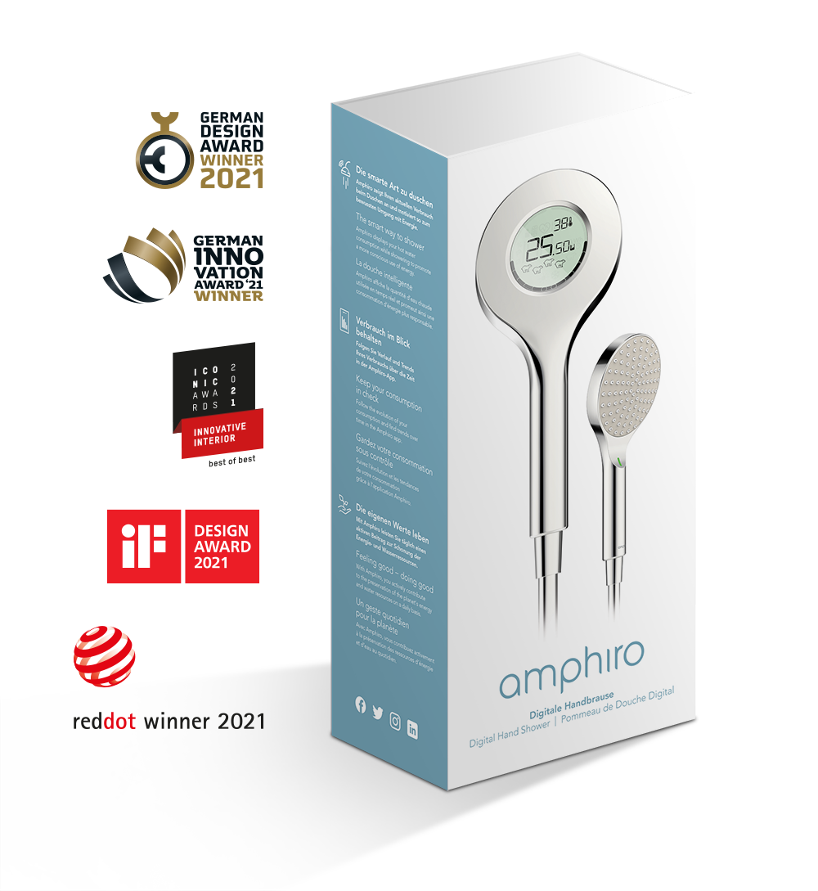

#  Amphiro Digital Hand Shower
This component supports reading sensor data from [Amphiro Digital Hand Shower](https://amphiro.com/en/products/digital-hand-shower) with the new [bluetooth component](https://www.home-assistant.io/integrations/bluetooth/) released in Home Assistant [2022.8](https://www.home-assistant.io/blog/2022/08/03/release-20228/#first-class-bluetooth-support). 

## Protocol
This wouldn't be possible without the work from https://gitlab.com/baze/amphiro_oras_bluetooth_shower_hub

The Amphiro has three types of BLE protocols:

- passive: This is what this uses, 'service_uuids': ['0000180a-0000-1000-8000-00805f9b34fb', '7f402200-504f-4c41-5261-6d706869726f', '00004132-504f-4c41-5261-6d706869726f'], this has the same format as the status event in the next bullet
- connected: supported by  https://gitlab.com/baze/amphiro_oras_bluetooth_shower_hub
- paired: The official app requires manual pairing with  a pin displayed from the app. seems to also provide historic data. undocument so far.

